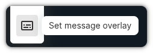
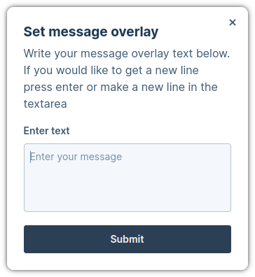
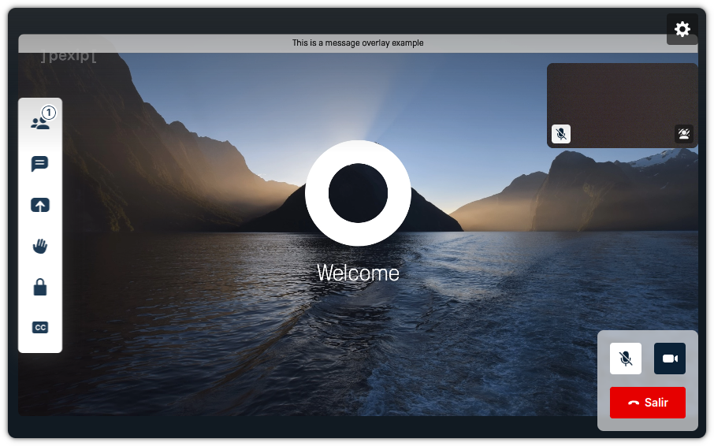

# Web App 3 Plugin: Message Overlay

This plugin enables host participants to use the message overlay feature and
establish a message that will be seen by all the participants.

This feature was introduced in **Pexip Infinity v35**, therefore you will need
to use this version or a later one.

## How to use

To activate this feature, the host must click the toolbar button. Note that this
option is only available during conferences that do not use direct media. If the
conference uses direct media, the button will not be available.

<div align='center'>



</div>

After clicking on "Set message overlay" you will see a dialog to enter the text
that will appear on the remote video:

<div align='center'>



</div>

Once you click on "Submit", all the participants will see the message on the top
of the screen:

<div align='center'>



</div>

## Run for development

- To be able to build the plugin, you need to comply with the following versions
  or higher:

  | NodeJS   | NPM     |
  | -------- | ------- |
  | v20.12.2 | v10.5.0 |

- Install all the dependencies:

```bash
$ npm i
```

- Run the dev environment:

```bash
$ npm start
```

The plugin will be served from https://localhost:5173 (visit that page and
accept the self-signed certificates), but you should access it thought the Web
App 3 URL. You have more information about how to configure your environment in
the
[Developer Portal: Setup guide for plugin developers](https://developer.pexip.com/docs/plugins/webapp-3/setup-guide-for-plugin-developers).

## Build for production

To create a package, you will need to first install all the dependencies:

```bash
$ npm i
```

And now to create the package itself:

```bash
$ npm run build
```

Congrats! Your package is ready and it will be available in the `dist` folder.
The next step is to create a Web App3 branding and copy `dist` into that
branding.

If you want to know more about how to deploy your plugin in Pexip Infinity,
check our [Developer Portal](https://developer.pexip.com).
